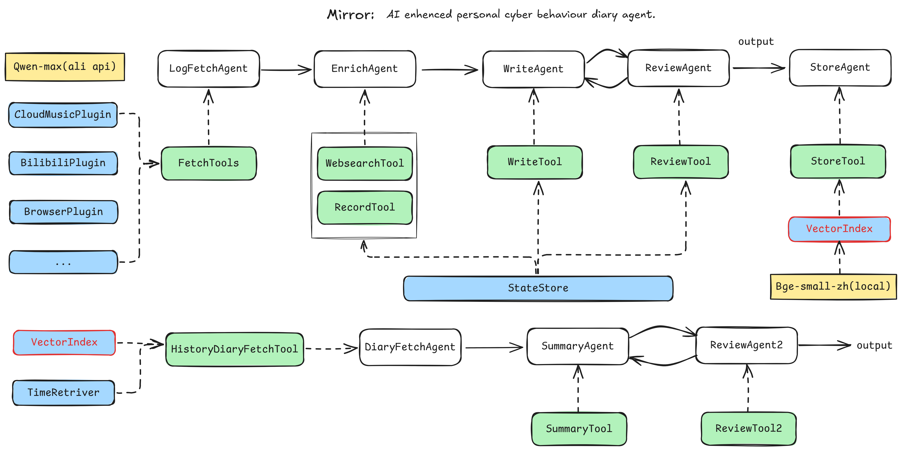

# Mirror 🌐🪞

*Your personal cyber diary assistant.*

## 🚀 项目简介

**Mirror** 是一个基于 [LlamaIndex](https://github.com/jerryjliu/llama_index)、[Tavily](https://docs.tavily.com/)、[OpenWeatherMap](https://openweathermap.org/) 构建的个人日记助理。它可以从多个信息源中提取你当天的上网行为，一键生成风格统一、内容丰富的“冲浪日记”，并支持每周总结。

## ✨ 功能特性

1. 📝 **一键生成“今日冲浪日记”**
   自动读取你的网络行为记录（目前支持：浏览器历史、网易云音乐听歌记录、Bilibili 观看记录），配合天气和检索增强，生成结构化且自然流畅的个人日记。

2. 📅 **一键总结本周日记**
   基于你最近一周的生成日记，通过 LLM 自动整理出重点内容、关键词、兴趣趋势等，帮助你更好地理解自己的“数字自我”。

## 🔧 技术栈

- [LlamaIndex](https://github.com/jerryjliu/llama_index)：作为语义索引与文档检索的核心框架
- [Tavily Search API](https://docs.tavily.com/)：增强网络行为内容的上下文
- [OpenWeatherMap API](https://openweathermap.org/)：记录每日天气信息
- 插件化架构，便于扩展新的数据源

## 📦 当前支持插件

- 🌍 浏览器历史记录（本地解析）
- 🎵 网易云音乐听歌记录
- 📺 Bilibili 观看记录

## 📌 TODO

- [ ] 更方便的本地配置（自动登录、文件路径管理）
- [ ] 更多插件支持（如抖音、微博、YouTube 等）
- [ ] 更丰富的功能（如与日记聊天、搜索事件、情绪趋势分析等）

## 🛠️ 快速开始

> ⚠️ 本项目目前仍处于早期阶段，请根据 `requirements.txt` 安装依赖，配置 API Key 后运行主程序。
